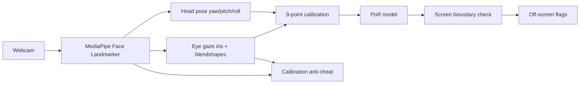

# GazeProctor

**Browser-based AI mock interview with real-time gaze proctoring.**

GazeProctor runs entirely in the candidate's browser. A webcam feed is processed locally with [Google MediaPipe Face Landmarker](https://ai.google.dev/edge/mediapipe/solutions/vision/face_landmarker) — no video is uploaded. After a short calibration, the system maps head pose and eye movement to screen coordinates and flags when the candidate looks off-screen, loses face tracking, or switches tabs.

---

## Features

| Area | What it does |
|------|----------------|
| **9-point gaze calibration** | Follow dots across the screen to build a personalized point-of-regard (PoR) model — detection works regardless of seating distance or head position. |
| **Off-screen detection** | Flags sustained looks beyond the screen boundary (left, right, up, down) with direction and confidence. |
| **Calibration anti-cheat** | Iris landmark checks, head-sweep detection, and pinned-eye detection block fake calibrations (eyes not following dots). |
| **Face-lost detection** | Alerts when the face disappears from the camera for too long. |
| **Tab / focus monitoring** | Records when the candidate leaves the interview window or switches tabs. |
| **AI interview flow** | Built-in question bank with text-to-speech questions and speech-to-text answers. |
| **Audit trail** | Session integrity score, incident log, and JSON/CSV export for review. |
| **Developer harness** | Headless trace replay and corpus evaluation for tuning detection without a live camera. |

---

## Privacy

- All face tracking runs **on-device** in the browser via WebAssembly.
- Webcam frames are **never sent** to a server.
- Reports are generated locally and downloaded only when the user clicks export.

---

## Quick start

### Requirements

- **Chrome** or **Edge** (recommended) — WebGL2 + WASM for MediaPipe
- Webcam
- A local HTTP server (required for ES modules and the model file)

### Run locally

```bash
cd ai-interview

# Option A — Python
python -m http.server 8080

# Option B — Node
npx serve -p 8080
```

Open **http://localhost:8080** in your browser.

1. Click **Start & Calibrate** and allow camera access.
2. Complete the **9-point** calibration (default) by following each dot.
3. The interview session starts — stay focused on the screen.

> **Tip:** Enable fullscreen during calibration so the browser viewport aligns with your physical monitor.

### Calibration modes

| Mode | Button label | Best for |
|------|--------------|----------|
| **9-point** (default) | `Calibration: 9-point` | Primary mode — maps gaze to screen coordinates via PoR regression. |
| **Quick** | `Calibration: Quick` | 3-second neutral baseline only; uses angular head+eye thresholds (less precise). |
| **4-corner** | Toggle via mode button | Looks at each screen corner to derive angular thresholds for your setup. |

---

## How it works



1. **MediaPipe** extracts 478 face landmarks (including iris), head transformation matrix, and eye blendshapes every frame.
2. **Calibration** collects samples at known screen positions and fits a ridge-regression PoR model (`gaze-mapping.mjs`).
3. **Detection** projects the current gaze onto normalized screen coordinates and compares against soft/hard boundaries (`gaze-mapping.mjs` → `proctor.js`).
4. **Anti-cheat** during calibration validates that iris movement matches dot direction (`cal-iris-anticheat.mjs`).
5. **Incidents** are debounced (warning at ~0.5 s, permanent flag at ~4 s off-screen).

---

## Project structure

```
eyeGazer/
├── README.md                 ← you are here
└── ai-interview/             ← runnable application
    ├── index.html            ← entry point
    ├── css/style.css
    ├── js/
    │   ├── gaze-engine.js    ← MediaPipe loop, calibration capture
    │   ├── proctor.js        ← UI, incidents, anti-cheat orchestration
    │   ├── gaze-math.mjs     ← head/eye math, angular fallback
    │   ├── gaze-mapping.mjs  ← PoR model fit + screen boundary logic
    │   ├── cal-iris-anticheat.mjs
    │   ├── detection-core.mjs← headless replay state machine
    │   └── interview.js      ← Q&A flow (TTS / STT)
    ├── models/
    │   └── face_landmarker.task
    ├── vendor/tasks-vision/  ← MediaPipe WASM bundle (vendored)
    ├── corpus/               ← labeled traces for evaluation
    ├── tests/                ← Node unit tests
    ├── tools/                ← eval, replay, synthetic trace generators
    └── HARNESS.md            ← developer tuning loop docs
```

---

## Proctoring incidents

| Type | Trigger |
|------|---------|
| `offscreen` | Gaze point leaves the screen rectangle for ≥ 4 s |
| `facelost` | No face detected for ≥ 1.5 s |
| `tabswitch` | Window blur or `visibilitychange` while session is active |

Each incident records timestamp, direction (if applicable), confidence, and head/gaze telemetry at the time of the event. Export via **Download JSON** or **Download CSV** on the session summary screen.

---

## Development & testing

All commands run from `ai-interview/`:

```bash
# Unit tests
node --test tests/gaze-math.test.mjs
node --test tests/gaze-mapping.test.mjs
node --test tests/detection-core.test.mjs
node --test tests/cal-iris-anticheat.test.mjs

# Replay corpus against current thresholds (exit 1 on failure)
node tools/eval.mjs corpus

# Replay a single trace with threshold overrides
node tools/replay.mjs corpus/off-left.json --SOFT_YAW=20
```

See [`ai-interview/HARNESS.md`](ai-interview/HARNESS.md) for the full autonomous tuning workflow, including how to record real labeled traces from the browser console:

```js
Proctor.startRecording("off-left")
// ... look off the left edge ...
Proctor.stopRecording({ flag: true, direction: "left", offFromMs: 300 })
```

---

## HUD telemetry

During a session, the debug HUD shows:

- **Yaw / Pitch** — PoR screen coordinates (when calibrated) or head angles
- **Gaze level** — `none` | `soft` | `hard`
- **Eye** — `i:` iris landmark gaze, `b:` blendshape gaze, source tag `(iris)` or `(blend)`

If the source shows `(blend)`, landmark iris was unavailable and anti-cheat falls back to blendshapes.

---

## Tech stack

- **MediaPipe Tasks Vision** — Face Landmarker (WASM, GPU with CPU fallback)
- **Vanilla JavaScript** — ES modules + classic scripts, no build step
- **Web Speech API** — TTS questions, STT answers
- **Node.js** — unit tests and offline trace evaluation only

---

## Browser support

| Browser | Status |
|---------|--------|
| Chrome / Edge | Supported (recommended) |
| Firefox | May work; WASM/GPU delegate less reliable |
| Safari | Limited; test before production use |

---

## License & attribution

- Application code: see repository license.
- **MediaPipe** — [Apache 2.0](https://github.com/google/mediapipe)
- **face_landmarker.task** — bundled Google model asset

---

## Troubleshooting

| Problem | Fix |
|---------|-----|
| Black camera / permission denied | Use `localhost` or HTTPS; grant camera permission in browser settings. |
| Model fails to load | Serve over HTTP (not `file://`); confirm `models/face_landmarker.task` exists. |
| False off-screen flags | Recalibrate in fullscreen; ensure 9-point mode completed successfully. |
| Calibration cheat popup | Look directly at each dot; keep head movement natural during dot grid. |
| HUD shows `(blend)` only | Iris landmarks unavailable — anti-cheat still runs via blendshapes; try Chrome with good lighting. |
